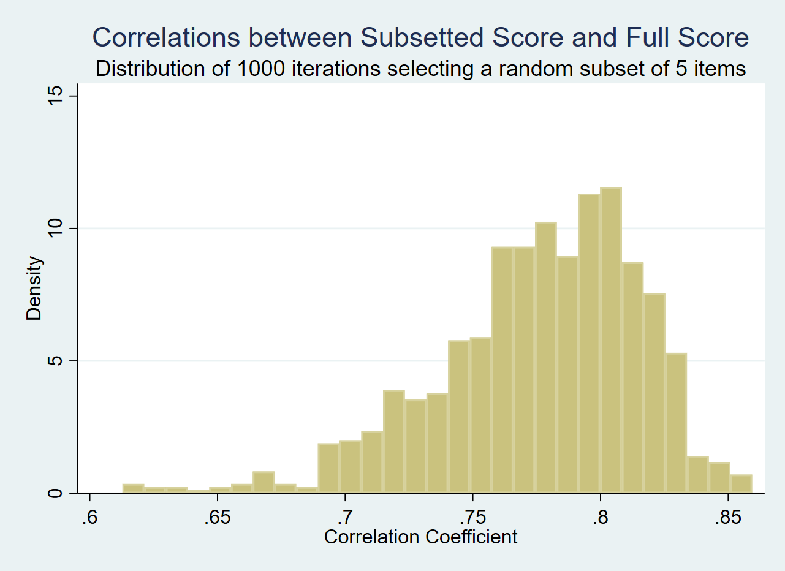
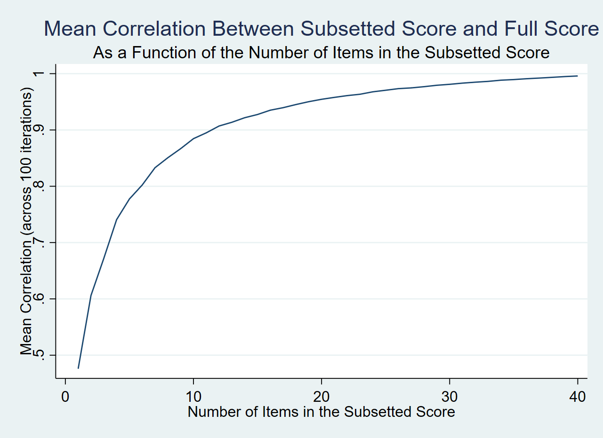
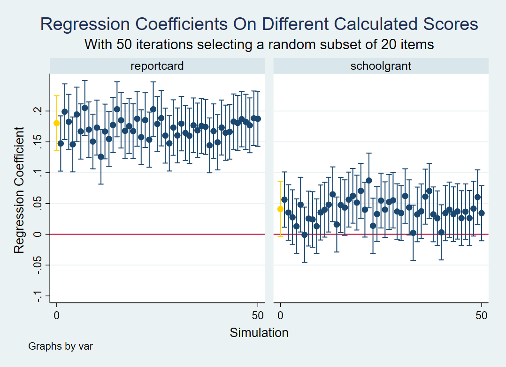

# subsetscore

## Syntax 

subsetscore is a user-written command written in Stata 16.

It calculates a standardized score from a full list of items then compares it to the same standardized score but calculated from a random subset only of that list of items, and iterates this operation multiple times. The objective is to understand how sensitive the full score is to the number and nature of items composing it. The command uses the egen functions sum() and std() to calculate the scores. It can be used for any scoring items for which it makes sense to calculate a normalized mean across a population.

There are two possible syntaxes depending on what is selected in the output() option. They are as follows:

> **subsetscore** *stubname*, **selected(n)** **iterations(i)** **output(out)**

*or*

> **subsetscore** *stubname*, **minselected(n)** **maxselected(m)** **iterations(i)** **output(out)**

*stubname* is the name of the items comprising the score. In the current version of the program, all items must have the same name, with a numerical suffix, much like in a *reshape* command. The numbers at the end of the stubname do not have to follow each other.

*iterations* is the number of times you want to randomly draw a subset of items to calculate a new score. The more iterations, the more informative the outputs will be, and the longer the program will take to run.

the option *selected* is required if the output is either **diff** or **corr**. It determines how many items you want to subset out of your full list of items. The default is 5. 
if you choose output **allcorr**, you will not enter a single number of items to be subsetted, but a minimum and a maximum number of items to be subsetted. The program will run all the simulations in between. 

*output* determines what the program renders. **diff** generates a distribution of the population differences between the full score and each subsetted scores. If you are working with a large population, that difference may be pretty small. **corr** generates a distribution of the correlation between the full score and each subsetted score in your population. **allcorr** calculates the correlation between the full score and each subsetted score in your population, and displays the coefficients as a function of the number of items selected. This can help you determine what is the marginal benefit to adding one more item to your test, for example, if you are planning for data collection.

## Examples

`subsetscore test_item, selected(5) iterations(1000) output(corr)`  will start by calculating the standardized mean of all `test_item` variables in your dataset. It will then randomly select 5 items among your `test_item` variables and calculate a standardized mean for them. It will do this 1000 times, and calculate each time the correlation between the full score and the subsetted score in your population. The output will be an histogram of these 1000 correlation coefficients.

`subsetscore test_item, minselected(1) maxselected(40) iterations(100) output(allcorr)`  is like calling `subsetscore test_item, selected(1) iterations(100) output(corr)`, then `subsetscore test_item, selected(2) iterations(100) output(corr)` , then `subsetscore test_item, selected(3) iterations(100) output(corr)`, etc until `subsetscore test_item, selected(40) iterations(100) output(corr)`, without displaying any of these intermediary outputs. The final output will be showing the correlation coefficients of each subsetted score as a function of the number of items comprising the score.

# subsetscore_reg

## Syntax 

subsetscore_reg is a user-written command written in Stata 16.

Calculating the same standardized scores and their random subset as the subsetscore command, it thens runs your specified regression model (on the full test score variable), as well as the same regression model on each of the randomly created subsetted score variable. It the plots a result of the regression coefficients across each randomly generated subsetted test score.

The objective is to understand how sensitive are your regression results to the number of items used to calculate test scores.

The syntax is as follows

> **subsetscore_reg** *yvarname* *xvarnames* [if] [weights], **stubname(stubname)** **selected(n)** **iterations(i)** **[keep(varlist)]**

*yvarname* is the name of your regression outcome, i.e. the fully constructed score

*xvarnames* is the name of all your regressors (treatment indicators, covariates, etc.)

*stubname* is the name of the items comprising the score. In the current version of the program, all items must have the same name, with a numerical suffix, much like in a *reshape* command. The numbers at the end of the stubname do not have to follow each other.

*iterations* is the number of times you want to randomly draw a subset of items to calculate a new score. The more iterations, the more informative the outputs will be, and the longer the program will take to run.

*keep* is optional and allows you to specify which regression coefficients you want to display in the final graph

## Examples

`subsetscore_reg math_score reportcard schoolgrant, selected(20) iterations(50) stubname(math_item)`  will start by randomly selecting 20 items among your `test_item` variables and calculate a standardized mean for them for each individuals in your sample : that is your 20-item subsetted test score. It will do this 50 times. For each of the 50 subsetted scores calculated, it will run the same regression model you specified for your full score. It will then plot your intial regression coefficients (in gold) against the regression coefficients in the subsetted scores.

